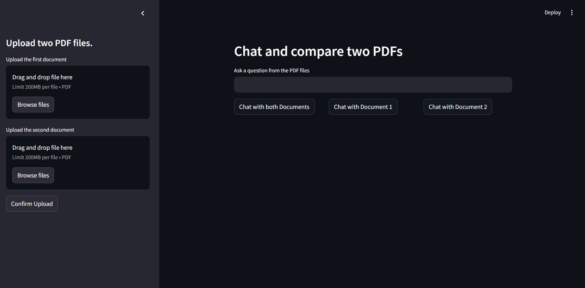

# Chat with two PDFs

This is a simple app to chat and compare two PDF files using LLMs from AWS Bedrock. You can choose to chat with just one or both after uploading your files. To build this you will need Python 3 and an AWS account. The app should look like this:

