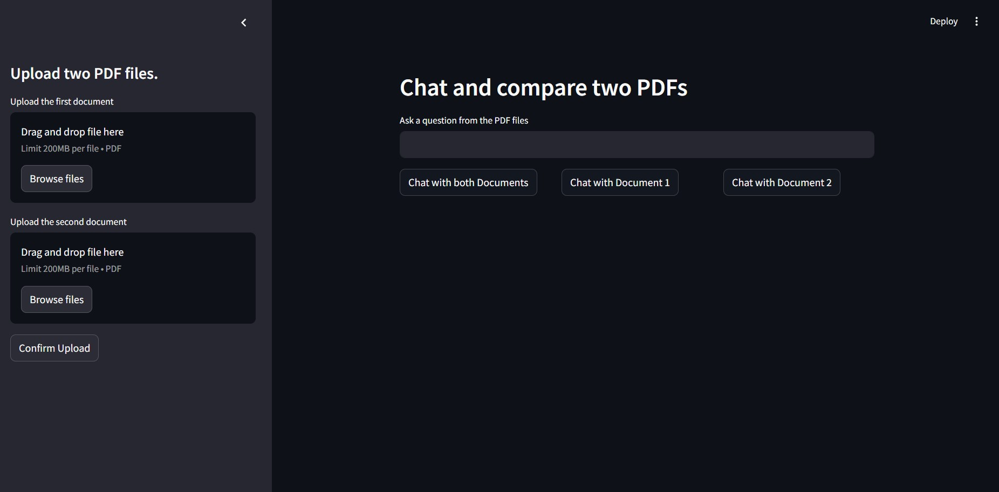

# Comparing two PDFs with AWS Bedrock

In this post we'll go over an extension of the typical app to chat with a PDF using RAG. Here we will specifically take in two PDFs, and compare them using a custom prompt. We'll also configure it to let the user decide if they only want to chat with one or both documents. Credits to Krish Naik for the original idea: https://www.youtube.com/watch?v=0LE5XrxGvbo&t=1065s. Also, see my GitHub repo for the code, and note that I used Python 3.12 in this case: https://github.com/RavinderRai/aws-llm-app.

To get started, make sure you have the AWS command line installed, streamlit, faiss-cpu (for vectorstores), langchain, PdfReader, and boto3. In AWS, you will also need to get access to a foundational model of your choice in AWS Bedrock. Keep in mind that it might not be free, so be careful with the use case (though it didn't cost me anything for this app). You can also find these requirements and the versions that were used here: https://github.com/RavinderRai/aws-llm-app/blob/main/requirements.txt.

The first thing to do of course is create a app.py file (or whatever you want to name it) for all the code below, and start with loading in the imports. Also instantiate bedrock and bedrock embeddings.


```python
import io
import boto3
import streamlit as st
from pypdf import PdfReader

from langchain_community.embeddings import BedrockEmbeddings
from langchain.llms.bedrock import Bedrock
from langchain.text_splitter import RecursiveCharacterTextSplitter
from langchain.docstore.document import Document
from langchain.vectorstores import FAISS
from langchain.prompts import PromptTemplate


## Bedrock Clients
bedrock=boto3.client(service_name="bedrock-runtime")
bedrock_embeddings=BedrockEmbeddings(model_id="amazon.titan-embed-text-v1",client=bedrock)

```

Now let's go over a function to get the data. Here's how it works: 

 - In streamlit later on you will see we let users upload their PDFs, so convert that to a file like object to then input it into PdfReader to process it. 
 - Then we iterate through each page in the PDF and concatenate it all into one string.
 - Next we divide the text into chunks of size 10000, and the chunk_overlap is to prevent odd break points in the text when we do this split, so relevant context isn't lost.
 - Finally we get these chunks into a list and convert them into Documents.

The Document function we get from langchain, and use as we are staying in the langchain ecosystem, but it is really just another way to store text data. It's like a dictionary with pageContent and metadata as keys. The metadata is meant to track things like the source of the text, but in this case we just leave it blank.


```python
def data_ingestion(pdf):
    pdf_reader = PdfReader(io.BytesIO(pdf.getvalue()))
    
    raw_text = ""
    for page in pdf_reader.pages:
        raw_text += page.extract_text()

    text_splitter = RecursiveCharacterTextSplitter(
        chunk_size=10000,
        chunk_overlap=1000
    )
    
    texts = text_splitter.split_text(raw_text)
    docs = [Document(page_content=t) for t in texts]
    
    return docs
```

Next we have functions to load in vector stores and the llm. We are using FAISS to store our data, with bedrock embeddings that we loaded in earlier. You can of course modify the embeddings to your choosing.

For the model, you can choose whichever you have access to in AWS Bedrock. To get the model_id log in to your AWS account and go to Bedrock. Then in the side bar click on Providers, and at the top select one. To get the one we selected here (meta.llama3-8b-instruct-v1:0), pick Meta, and then scroll down to the Llama models section and select Llama 3 8B Instruct. Then once again scroll down to the API request section and you'll find the model_id along with other parameters you can modify.


```python
def get_vector_store(docs, index_name):
    if not docs:
        raise ValueError("The document list is empty. Please check the data ingestion process.")
    
    vectorstore_faiss=FAISS.from_documents(
        docs,
        bedrock_embeddings
    )
    vectorstore_faiss.save_local(index_name)

def get_llm():
    ## create the Anthropic Model
    llm=Bedrock(
        model_id="meta.llama3-8b-instruct-v1:0", 
        client=bedrock,
        model_kwargs={'max_gen_len':512}
    )
    return llm
```

Now the fun part, let's define our prompt. You can change it if needed, but the point here is to instruct the model to respond to a question about one or both documents. I found if you don't leave a note to only answer based on one document if you only were given one, then it will leave a note itself in the response saying there was no second document. But try it out and see for yourself. Otherwise, I've instructed it to respond by comparing the documents, rather than just simply answering the question.


```python
prompt_template = """
Human: You are provided with context from one or two documents. 
Use the information from one or both documents to answer the question at the end. 
More specifically, if you only have one, then only answer given that document.
But if you have two, then answer as if you are comparing or contrasting them. 
Summarize with at least 250 words with detailed explanations. 
If you don't know the answer, just say that you don't know, don't try to make up an answer.

<Document 1 Context>
{context1}
</Document 1 Context>

<Document 2 Context>
{context2}
</Document 2 Context>

Question: {question}

Assistant:"""
```

For the next function, we get the vector stores and do a similarity search. This will get the top 3 relevant parts of the PDF, and add them together to make a context string. We seperate this into two parts though, one if the user wants to compare both documents, and another if they only want to chat to one only, in which case we only load that PDFs respective context. Then we format the prompt to give it the contexts, leaving one as an empty string if the user chose to only speak to one document.


```python
def get_response_llm(llm, vectorstore_faiss1, vectorstore_faiss2, query, use_both=False, use_1_or_2=1):
    if use_both:
        retriever1 = vectorstore_faiss1.as_retriever(search_type="similarity", search_kwargs={"k": 3})
        retriever2 = vectorstore_faiss2.as_retriever(search_type="similarity", search_kwargs={"k": 3})

        docs1 = retriever1.get_relevant_documents(query)
        docs2 = retriever2.get_relevant_documents(query)

        context1 = "\n".join([doc.page_content for doc in docs1])
        context2 = "\n".join([doc.page_content for doc in docs2])

    else:
        if use_1_or_2==1:
            retriever1 = vectorstore_faiss1.as_retriever(search_type="similarity", search_kwargs={"k": 3})
            docs1 = retriever1.get_relevant_documents(query)
            context1 = "\n".join([doc.page_content for doc in docs1])
            context2 = ""
        elif use_1_or_2==2:
            retriever2 = vectorstore_faiss2.as_retriever(search_type="similarity", search_kwargs={"k": 3})
            docs2 = retriever2.get_relevant_documents(query)
            context1 = ""
            context2 = "\n".join([doc.page_content for doc in docs2])

    prompt = PROMPT.format(context1=context1, context2=context2, question=query)
    answer = llm(prompt)
    return answer
```

In the final function, this is where we actually call the function above depending on what the user selected. In the streamlit app we have buttons, one for use_both, and use_1_or_2, each respective of whether the user wants to chat with both documents or just one of the two. We also wrap this all in a try and except block to catch common errors like not uploading both files.


```python
def chat_with_documents(user_question, use_both, use_1_or_2=None):
    try:
        with st.spinner("Processing..."):
            llm = get_llm()
            if use_both:
                vectorstore_faiss1 = FAISS.load_local("faiss_index1", bedrock_embeddings, allow_dangerous_deserialization=True)
                vectorstore_faiss2 = FAISS.load_local("faiss_index2", bedrock_embeddings, allow_dangerous_deserialization=True)
                response = get_response_llm(llm, vectorstore_faiss1, vectorstore_faiss2, user_question, use_both=True)
            elif use_1_or_2 == 1:
                vectorstore_faiss1 = FAISS.load_local("faiss_index1", bedrock_embeddings, allow_dangerous_deserialization=True)
                response = get_response_llm(llm, vectorstore_faiss1, None, user_question, use_both=False, use_1_or_2=1)
            elif use_1_or_2 == 2:
                vectorstore_faiss2 = FAISS.load_local("faiss_index2", bedrock_embeddings, allow_dangerous_deserialization=True)
                response = get_response_llm(llm, None, vectorstore_faiss2, user_question, use_both=False, use_1_or_2=2)
        return response
    
    except UnboundLocalError:
        st.write(f"Please upload {'both documents' if use_both else f'document {use_1_or_2}'}")
    
    except Exception as e:
        error_type = type(e).__name__
        st.write(f"An error occurred: {e} (Error type: {error_type})")
    
    return ""
```

And finally, we have our main function which defines our streamlit app. It is pretty straightforward though, starting with some configurations and titles, followed by a user input text box for the query. We also initialize the response to and empty string.

In the side bar, we add two file_uploarder buttons. You can actually set it to allow multiple file uploads, but we don't want that here as we want exactly 2, and for them to be seperate. Then we have a confirm upload button to download them into vector databases.

As for the main app, we just have the user input at the top, with the 3 buttons below it, stacked horizontally in one row. Then we write the response from the LLM below all this.


```python
def main():
    st.set_page_config(page_title="Chatting with two PDFs", page_icon=":books:")
    st.header("Chat and compare two PDFs")

    user_question = st.text_input("Ask a question from the PDF files")
    response = ""

    with st.sidebar:
        st.title("Upload two PDF files.")
        pdf1 = st.file_uploader("Upload the first document", type="pdf")
        pdf2 = st.file_uploader("Upload the second document", type="pdf")

        if st.button("Confirm Upload"):
            with st.spinner("Processing..."):
                doc1 = data_ingestion(pdf1)
                doc2 = data_ingestion(pdf2)

                get_vector_store(doc1, "faiss_index1")
                get_vector_store(doc2, "faiss_index2")

                st.success("Done")

    col1, col2, col3 = st.columns(3)

    if col1.button("Chat with both Documents"):
        response = chat_with_documents(user_question, use_both=True)

    if col2.button("Chat with Document 1"):
        response = chat_with_documents(user_question, use_both=False, use_1_or_2=1)

    if col3.button("Chat with Document 2"):
        response = chat_with_documents(user_question, use_both=False, use_1_or_2=2)

    st.write(response)
```

And that's it for this app. If it runs then it should look like this (that is, if you're using dark mode). Feel free to add, modify, or extend this app to your liking! And again credits to Krish Naik for this original inspiration here: https://www.youtube.com/watch?v=0LE5XrxGvbo&t=1065s.




